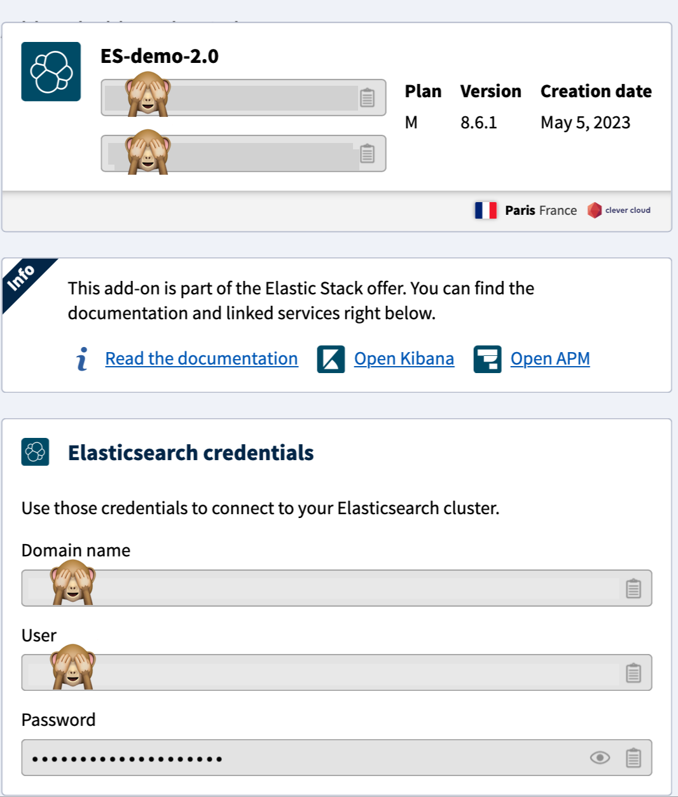

# Add Elastic Application Performance Monitoring to your apps on Clever Cloud

## Create an APM Server on Clever Cloud

[Instructions on how to create an ES addon and add APM and Kibana. Eventually add details about what is each app.]

Do not connect the Elastic Stack addon to your apps or you'll get the wrong envrironment variables.

## Connect your apps

Regardless of the language of your app, you'll need to connect your app to the APM on Clever Cloud.

### Step 1: From the Clever Cloud Console

Follow these steps to connect your app deployed on Clever Cloud to Elastic APM.

#### Steps

1. Go to your app menu "Service Dependencies"
2. Choose "Link applications" and select your APM app.
3. Restart your app to deploy with new APM environment variables.

### Step 2: Check the connection

Now you can open your APM dashboard and check if your app appears in the _Services_ list. It will appear by the name you gave it on the Console.

### Not seeing your app in Kibana?

In some cases (like WordPress), previous steps all you'll need to do, but most apps will need to get the Elastic agent from core.

If you open APM and don't see your app listed in the _Services_ list, it means you'll need to make a quick set up in the code.

Check this repository to find step-by-step instructions that fits your app language. Folders contain ready-to-work-example files that you can just add to your app and commit.

## Export your logs to Elastic

You can export your logs to your Elastic addon with **clever-tools**, Clever Cloud CLI. See [installation options](https://www.clever-cloud.com/doc/getting-started/cli/) to get started.

Once you got clever-tools installed, just create a log drain with the following commands:

```
clever drain create ElasticSearch https://xxx-elasticsearch.services.clever-cloud.com/_bulk --username USERNAME --password PASSWORD
```

**What does this command means?**

- `clever drain create` is the command to create a drain
- `ElasticSearch` allows you to use the Elastic bulk API
- Fill the rest with **Elasticsearch credentials** you'll find on your Elastic Addon dashboard.


